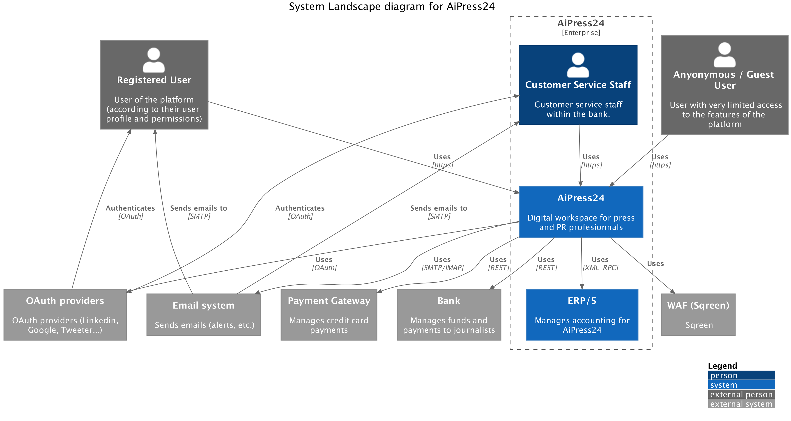
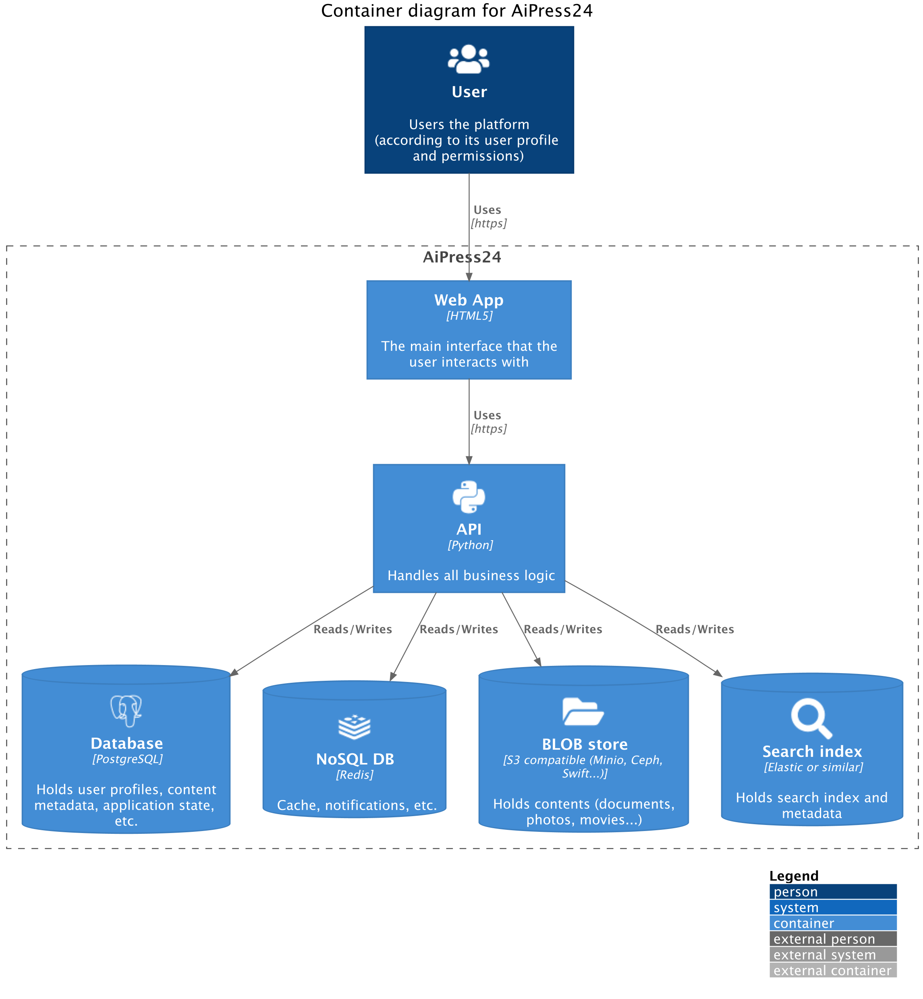
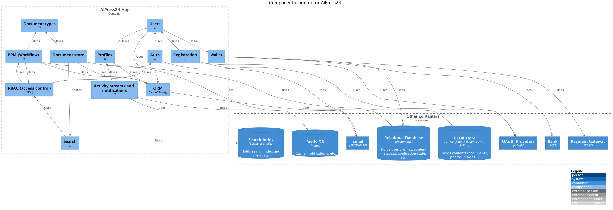

# AIpress24 Architecture

## C4 Diagrams

### Context diagram (level 1)

### Container diagrams (level 2)

### Component diagrams (level 3)

## Modules

L'application est décomposée en modules (dans le répertoire `src/app/modules`), chaque module intégrant son/ses propres:

- Modèle de données (via l'ORM)
- Pages/vues (via Flask/Pagic)
- Templates (via Jinja2)
- Ses composants d'UI (le cas échéant)

Les modules sont nommés selon la convention suivante:

- abo: gestion des abonnements
- admin: administration
- api: API
- biz: marketplace ("Market")
- common: éléments communs à tous les modules
- dashboard: dashboard
- events: événements ("Events")
- iam: gestion des identités et des accès (pas utilisé)
- kyc: gestion de l'inscription et de la validation des membres
- oauth: gestion de l'authentification via OAuth2 (pas utilisé)
- preferences: gestion des préférences utilisateur
- public: pages publiques
- search: moteur de recherche
- security: gestion de la sécurité
- swork: social network ("Social")
- wallet: gestion des paiements
- wip: backoffice utilisation / gestion des contenus ("Work")
- wire: frontal de publication ("News")

Note: les noms "Biz", "Swork" et "Wire" sont un résidu historique, et ont été renommés dans l'interface utilisateur, mais pas dans le code.)

## Services

L'application repose par ailleurs sur les services suivants:

- activity_stream: flux d'activité
- config: configuration
- emails: envoi d'emails
- healthcheck: vérification de l'état de l'application
- images: gestion des images
- invoicing: facturation
- json_ld: génération de JSON-LD
- moderation: modération
- opengraph: génération de meta tags OpenGraph
- pdf: génération de PDF
- promotions: gestion des promotions
- reputation: gestion de la réputation
- roles: gestion des rôles
- screenshots: génération de screenshots
- security: gestion de la sécurité
- social_graph: graphe social
- stats: statistiques
- tagging: gestion des tags
- tracking: tracking des lectures
- web: requêtes HTTP sortantes

Ces services sont soit importés directement dans les modules qui en ont besoin (lorsqu'il s'agit d'objet stateless, ou de fonctions), soit exposés via un conteneur de services (actuellement home-grown, en cours de migration vers [svcs](https://svcs.hynek.me/)).
