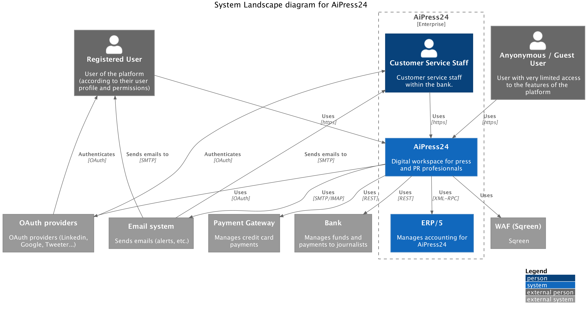
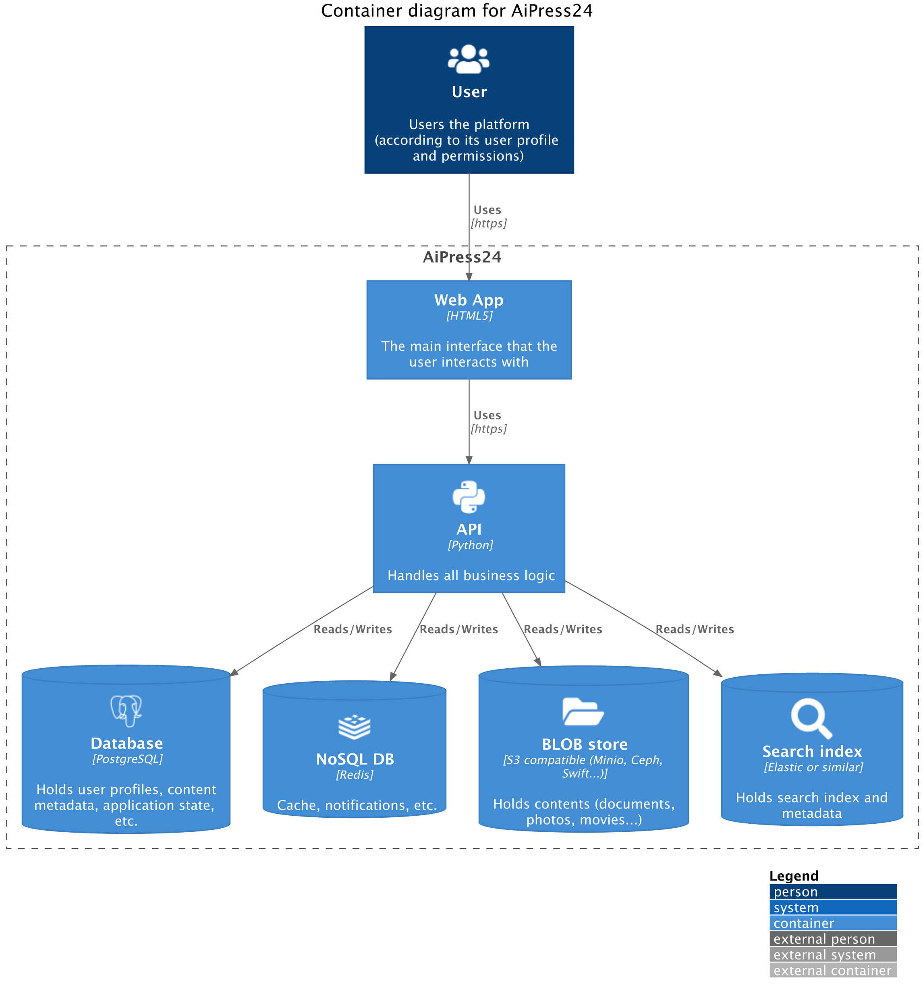
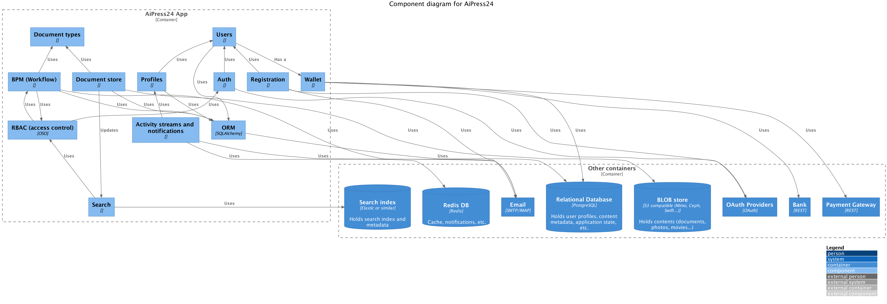

# Aipress24 Architecture

## C4 Diagrams

### Context diagram (level 1)

### Container diagrams (level 2)

### Component diagrams (level 3)

## Modules

See [Modules](./modules/).

## Services

See [Services](./services/).

## Architecture Notes

### Core Framework Features (Flask)

1.  **Routing:** Uses Blueprints (`app/modules/*/__init__.py`) to organise routes, combining standard Flask `@blueprint.route` with **flask-classful** class-based views for CRUD (`app/modules/wip/crud/cbvs/`). Navigation entries are declared with `configure_nav(...)`.
2.  **Request/Response Handling:** Uses Flask's `request` and `Response` objects, handling GET/POST in view functions and CBVs. Uses `redirect`, `jsonify`, `send_file`.
3.  **Templating (Jinja2):** Uses Jinja2 via Flask's default integration.
    *   Template Loading: Loads templates from `app/templates`.
    *   Context Processors: Injects variables globally into templates (`app/flask/hooks.py`, `app/flask/jinja.py`).
    *   Custom Filters: Defines custom template filters (`app/ui/datetime_filter.py`, registered in `app/flask/main.py`).
    *   Custom Macros/Globals: Defines and registers custom macros/global functions (`app/ui/macros/`, `app/flask/lib/macros.py`).
4.  **Middleware / Request Lifecycle Hooks:**
    *   **Flask:** Uses `before_request` hooks (e.g., authentication, injecting extensions) and `after_request` (e.g., performance monitoring). Error handlers (`errorhandler`) are registered. (`app/flask/hooks.py`, `app/flask/main.py`).
    *   **Dramatiq:** Uses custom middleware (`AppContextMiddleware`) to manage Flask's application context within background tasks.
5.  **Configuration Management:** Uses `Dynaconf` for layered configuration from files (`etc/settings.toml`, `etc/secrets.toml`) and environment variables (`app/flask/config.py`).
6.  **Application Factory Pattern:** `app/flask/main.py` (`create_app`) uses functions to create and configure the application instances. This allows for different configurations (e.g., testing).
7.  **Static File Serving:** Implicitly uses Flask's static file handling (`app/static`). Also integrates with `Flask-Vite` for modern frontend asset management.
8.  **Session Management:**
    *   Uses Flask's standard session mechanism (likely cookie-based initially).
    *   A custom `SessionService` (`app/services/sessions/`) built on top of a database model (`Session`) provides a more persistent, user-or-session-id-tied storage mechanism.

### Flask Extensions & Integrations

9.  **Database Integration (ORM):**
    *   **Flask-SQLAlchemy:** Used for integrating SQLAlchemy with Flask (`app/flask/extensions.py`). Includes session management tied to the request lifecycle. Defines models using declarative base (`app/models/`).
    *   **Flask-Migrate:** Handles database schema migrations based on model changes.
    *   **SQLAlchemy-Utils:** Used for utility types like `ArrowType`.
10. **Authentication & Authorization:**
    *   **Flask-Security-Too:** Manages user registration, login, password hashing, roles (`User`, `Role` models, `SQLAlchemySessionUserDatastore`), session authentication, and potentially other security features like email confirmation (though not explicitly shown being used everywhere). Decorators like `@roles_required` might be used (or custom checks like `has_role`).
11. **Forms Handling:**
    *   **Flask-WTF:** Used for creating and validating forms (`app/modules/wip/crud/cbvs/_forms.py`).
    *   **WTForms Custom Fields:** Custom field types are defined (`app/flask/lib/wtforms/fields/`) for richer UI elements (DateTime, Image, RichSelect, RichText).
    *   **Custom Form Rendering:** A `FormRenderer` (`app/flask/lib/wtforms/renderer.py`) is used to render WTForms with custom structure/styling (likely Tailwind/DaisyUI). The KYC module (`app/modules/kyc/dynform.py`) uses a dynamic form generation approach based on spreadsheet definitions.
12. **Internationalization (i18n/l10n):**
    *   **Flask-Babel:** Integrated for handling different languages and timezones (`app/flask/extensions.py`), although explicit usage (like `_()` translation calls) isn't visible. Timezone handling (`pytz`) is used.
13. **Email Sending:**
    *   **Flask-Mailman:** Used for sending emails (`app/flask/extensions.py`, `app/services/emails/`).
14. **Background Tasks & Scheduling:**
    *   **Dramatiq:** Used as a background task queue, likely with Redis as a broker (`app/dramatiq/`). Includes custom middleware for Flask app context.
    *   **APScheduler:** Used within the Dramatiq setup (`@crontab`) for cron-like scheduling of background tasks (`app/dramatiq/scheduler.py`).
    *   **Schedule library:** Used in the main `server/scheduler.py` for a simpler, in-process scheduler running in a separate thread.
15. **Command-Line Interface (CLI):**
    *   **Flask CLI:** Integrated via `flask_super` (`@command`, `@group`) to add custom commands for tasks like database management (`db2`, `fake`), bootstrapping, listing components/pages, running jobs, and managing the search index. (`app/flask/cli/`).
16. **Security Headers:**
    *   **Flask-Talisman:** Used to set security-related HTTP headers, including Content Security Policy (CSP), in non-debug environments.
17. **Frontend Integration:**
    *   **Flask-Vite:** Manages integration with the Vite frontend build tool.
    *   **Flask-HTMX:** Provides server-side support for HTMX interactions (detecting HTMX requests via `htmx.boosted`).
    *   **Custom Component System (PyWire):** A custom system inspired by Livewire/HTMX for building interactive UI components with server-side rendering and state management (`app/flask/lib/pywire/`). Handles component rendering (`markup_component`) and AJAX updates (`/livewire/message/` route).
18. **Admin Interface:**
    *   **SQLAdmin:** Used in the separate `adminapp` (Starlette-based) to provide a CRUD interface for database models.

### Architectural Patterns & Other Features

19. **Modular Application Structure (Blueprints):** Flask Blueprints are used to structure the application into logical modules (`app/modules/*`).
20. **Service Layer / Dependency Injection:** Uses `svcs` for registering and accessing services (`app/flask/services.py`, `app/services/`). Promotes decoupling.
21. **Repository Pattern:** Data access is often abstracted through Repository classes (`app/models/repositories.py`, `app/services/repositories/`).
22. **Model Mixins:** Reusable model functionalities (like ID generation, timestamps, ownership, address fields) are implemented using mixins (`app/models/mixins.py`).
23. **Class-Based Views:** CRUD-heavy modules use **flask-classful** class-based views (`app/modules/wip/crud/cbvs/`) on top of a shared table/form/renderer layer, rather than plain function views. (An older custom `Page` abstraction has been removed.)
24. **ASGI/WSGI Compatibility:** The admin app (`adminapp`, Starlette/Granian) is ASGI; the main Flask app is WSGI and can be mounted under ASGI via `asgiref.wsgi.WsgiToAsgi`.
25. **Application Server:** The main app runs under **gunicorn** (WSGI); the Starlette-based `adminapp` runs under **Granian** (ASGI). Development processes are orchestrated with **honcho** (`Procfile-dev`).
26. **Search Index Integration:** Full-text search is backed by an embedded **wesh** BM25 index (a single index keyed on the database URL), managed via the `flask search` CLI (`app/modules/search/`). *(Note: earlier revisions of this doc referenced Typesense.)*

### Tooling

27. **Package Management:** **`uv`** manages dependencies and virtual environments (the project is migrating away from Poetry). Build backend: `pdm-backend`.
28. **Quality Gates:** **`ruff`** (lint + format), the **`ty`** type checker (primary) and **`pyrefly`** (secondary), plus import-linting, `bandit` and `vulture`, run via `make lint`.
29. **Continuous Integration:** Runs on **GitHub Actions** (`.github/workflows/`: `ci.yml`, `tests.yml`, `lint.yml`) and, historically, SourceHut builds (`.builds/`). Deployment to Fly.io is wired via `fly-deploy.yml`.
