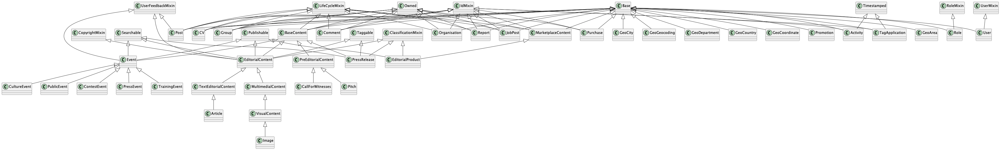
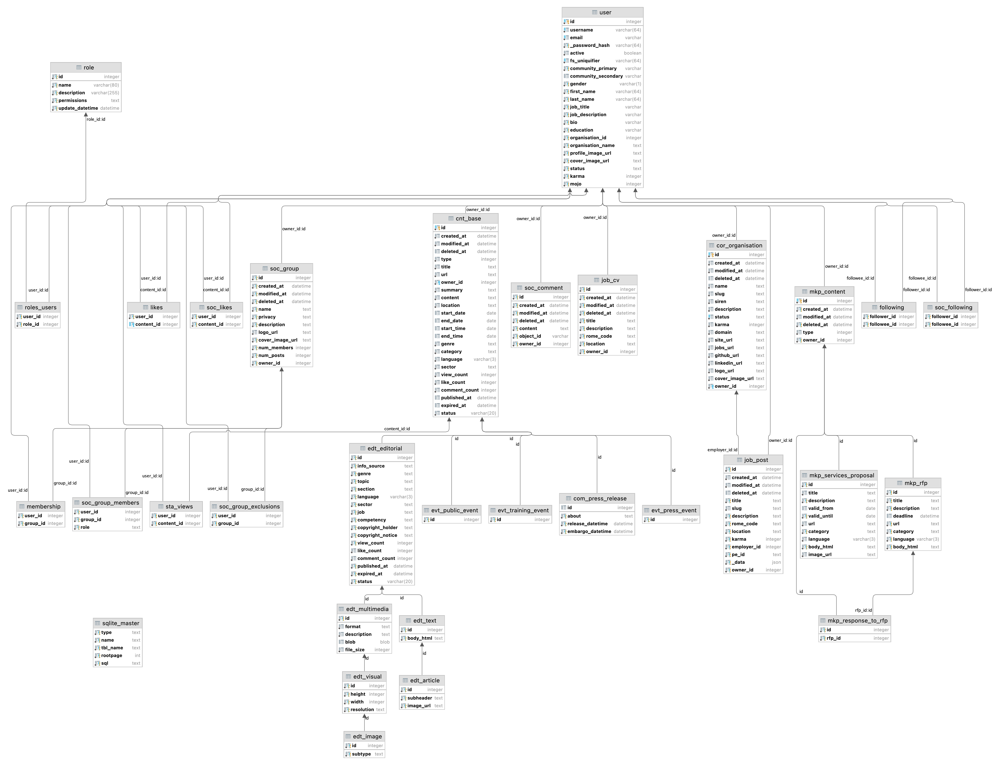

In AIpress24, data is managed by the PostgreSQL relational database. An object-relational (ORM) layer is implemented using the SQLAlchemy framework in Python.

## Schema

### Simple

### Detailed

Alternative view:

## Table prefixes

- `abo_`: subscriptions
- `adm_`: admin
- `aut_`: authentication (users, groupes, roles...)
- `cnt_`: content
- `com_`: communication
- `crp_`: corporate (aka business wall)
- `edt_`: editorial
- `evt_`: events
- `geo_`: geo-coding
- `inv_`: invoicing
- `job_`: job board
- `kyc_`: registration / know your customer
- `mkp_`: marketplace
- `nrm_`: newsroom
- `rep_`: reputation
- `rol_`: roles
- `soc_`: social
- `sta_`: statistics
- `str_`: activity streams
- `wal_`: wallet
- `web_`: web pages

Tables with no prefix: `blob`.
