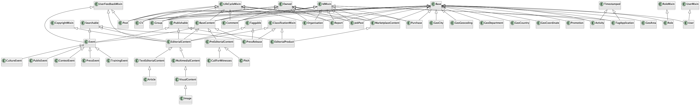
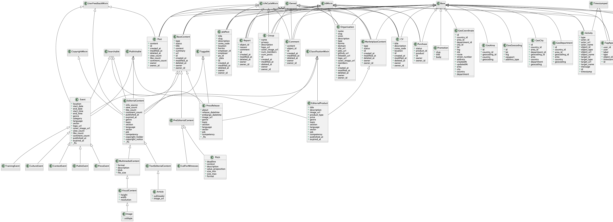
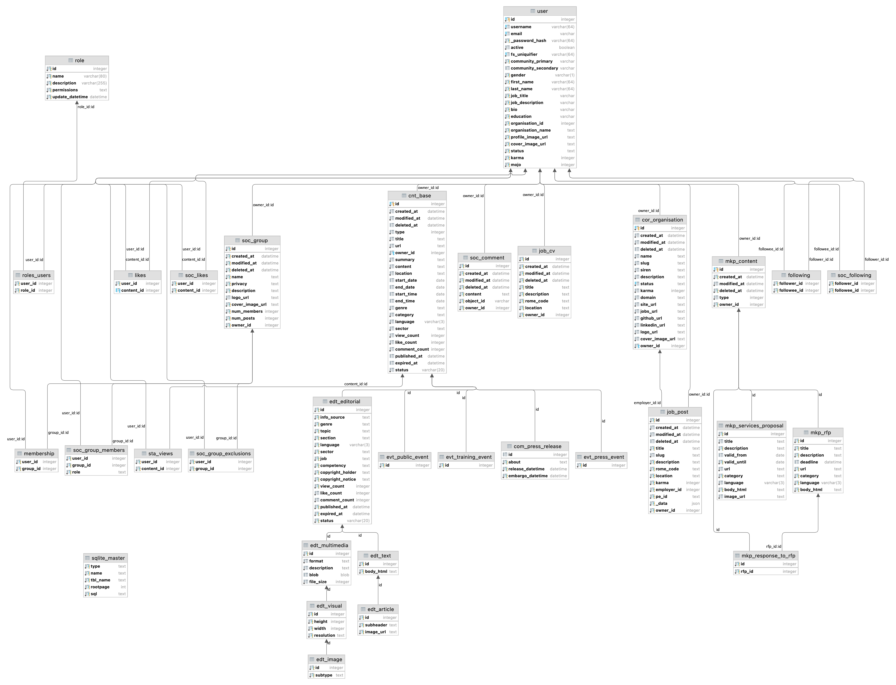

# Database

In Aipress24, data is managed by a **PostgreSQL** relational database (with SQLite used for most tests). The object-relational mapping (ORM) layer uses **SQLAlchemy 2.0** (modern `Mapped[...]` declarative style) together with **Advanced-Alchemy** (repositories, base classes, custom column types).

## Schema

### Simple

### Detailed

Alternative view:

## Migrations

Schema migrations are handled with **Alembic** (via Flask-Migrate); migration scripts live in the `migrations/` directory (`alembic.ini`, `migrations/versions/`). For a fresh development or test database, the schema can also be created directly from the models (`db.create_all()` / the bootstrap and fake-data commands) rather than replaying migrations.

## Table prefixes

Tables are namespaced by a short prefix reflecting the owning domain. The prefixes actually in use are:

| Prefix | Domain |
|---|---|
| `adm_` | admin |
| `aut_` | authentication (users, roles…) |
| `bw_` | Business Wall (activation, roles, partnerships, subscriptions, content, images) |
| `cms_` | CMS / static pages |
| `cnt_` | content |
| `crm_` | CRM |
| `crp_` | organisations (corporate) |
| `email_` | email |
| `evt_` | events (public feed) |
| `evr_` | Event'room |
| `frt_` | front-end / UI state |
| `geo_` | geo-coding |
| `inv_` | invoicing |
| `job_` | job board |
| `kyc_` | registration / Know Your Customer |
| `mkp_` | marketplace (missions, projects, jobs, products, applications) |
| `not_` | notifications |
| `nrm_` | newsroom (articles, sujets, commandes, avis d'enquête…) |
| `org_` | organisation-related |
| `rep_` | reputation |
| `ses_` | sessions |
| `soc_` | social graph (follows, likes) |
| `sta_` | statistics / tracking |
| `str_` | activity streams |
| `stripe_` | Stripe objects (subscriptions, products, prices) |
| `tag_` | tagging |
| `tax_` | taxonomies / ontologies |
| `wire_` | News feed posts |
| `web_` | web pages |
| `zip_` | postcodes / cities |

Tables with no prefix include `blob` (binary object storage metadata).

!!! note
    This list is generated from the models' `__tablename__` declarations and evolves with the code — check `src/app` for the authoritative set.
