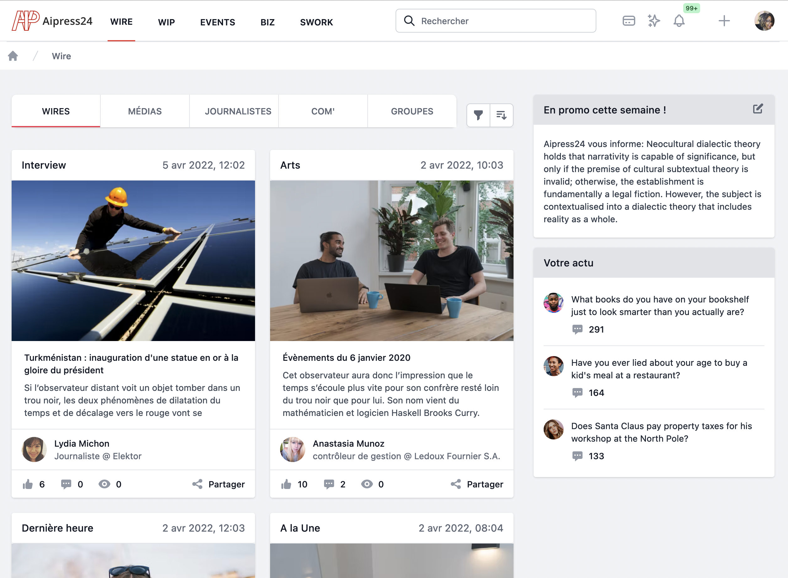
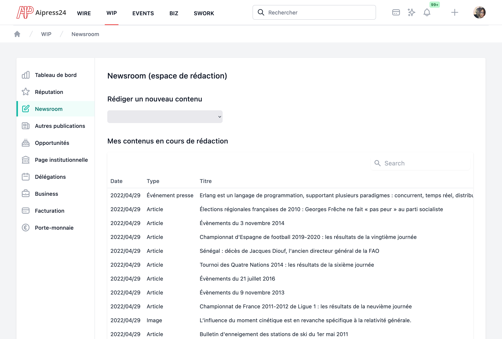
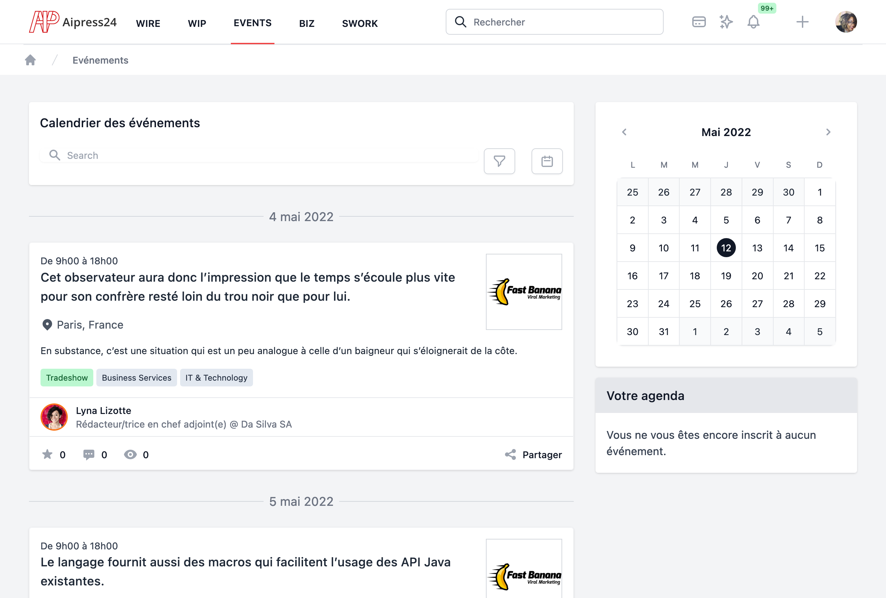
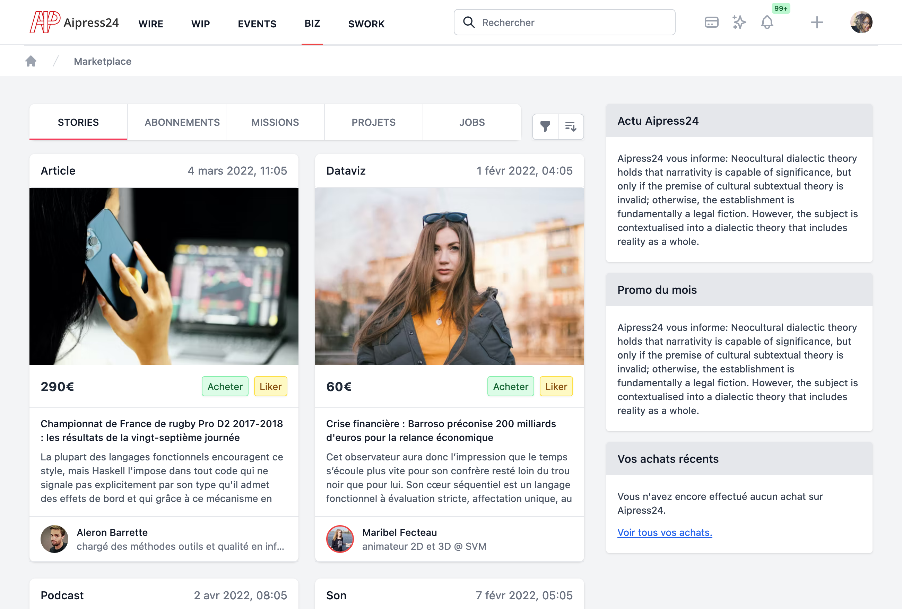
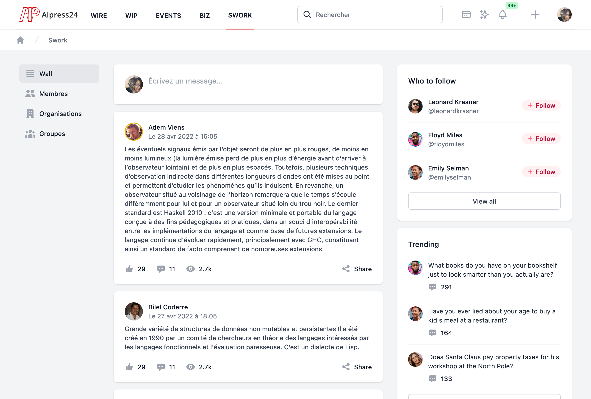

# Documentation du projet AIpress24

!!!note "🇬🇧 English version"
    For the 🇬🇧 English version of this documentation, please refer to the [User Guide](../user/en/) and [Developer Guide](../dev/).

## A propos d'AIpress24

AIpress24 est un projet, initié par l’agence [TCA](https://agencetca.info/) et réalisé techniquement par [Abilian](https://abilian.com/), de plateforme technologique originale, permettant de répondre aux besoins de la chaîne de valeur du journalisme.

Il s'agit une plateforme combinant les fonctionnalités d’un CMS dédié à la presse, avec celles de réseau social et de marketplace. A ce titre, il s’agit d'une véritable « newsroom collaborative 3.0 ». (Neto, B. et al, 2019)[^1].

Cette plateforme intègre de nombreux blocs fonctionnels, tels qu’un outil de production de contenus presse, collaboratif et en mode Web, un réseau social d’entreprise adapté aux besoins de collaboration des acteurs de la presse, etc.

En particulier, le produit vise à fluidifier les relations du journaliste avec l’écosystème complexe dont ce dernier fait partie, et notamment les relations entre :

- Les journalistes (qui enquêtent) et les communicants qui les mettent en relation avec les « leaders » (les personnes que les journalistes interviewent) ;
- Les communautés de la News Industry (journalistes, communicants et leaders) et les développeurs ("transformers") ;
- Les communicants (voire les leaders) et les fournisseurs de l’évènementiel.

[^1]: Neto, B. M., Ishikawa, E., Ghinea, G., & Grønli, T. M. (2019, January). Newsroom 3.0: managing technological and media convergence in contemporary newsrooms. In Proceedings of the 52nd Hawaii International Conference on System Sciences.

## Aperçu de l'application (prototype)

### Page NEWS (fils d'actu)

### Page WORK (back-office éditorial)

### Page EVENTS (agenda événementiel)

### Page MARKET (marketplace de produits et de services éditoriaux)

### Page SOCIAL (réseau social professionnel pour l'écosystème de la presse)

## Consulter la documentation

- [Documentation utilisateur](./user/fr/)

- [Developer documentation](./dev/)
