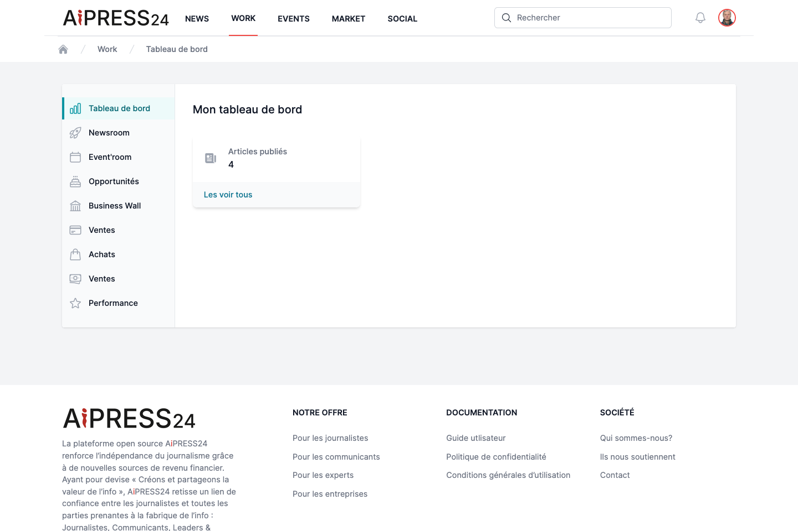

# Getting started on Aipress24

## Registration

Registration is handled through a **guided questionnaire** (known as "KYC", for *Know Your Customer*) that determines your community, your profile, your permissions and the public information on your card. From the home page, click **"S'inscrire"** (Register).

### 1. Choose your community and profile

You first indicate **which professional community you belong to**, then select the **profile** that matches you within that community. Aipress24 has five communities, each broken down into specific profiles. For example:

- **Press & Media**: news executive, journalist with/without a press card (employee, freelancer, or sole trader), institutional journalist, head of a journalists' union…
- **Communicators**: PR agency director or consultant, independent PR consultant, communication-department director or consultant.
- **Leaders & Experts**: executive, in-house expert, independent expert, an organisation's PR lead, investor, start-up founder, event organiser.
- **Transformers**: director or consultant in organisational transformation, innovation investor, head of a competitiveness cluster or incubator.
- **Academics**: institution director, journalism-school director, lecturer-researcher, PhD student, student, student-entrepreneur.

Your profile shapes the rest of the questionnaire, your community, and the Business Wall type that will be suggested to you.

### 2. Complete the questionnaire

The questionnaire is organised into successive sections:

- **Personal information** — identity, photo, main occupation, presentation, skills, languages, education, contact details (fields marked with `(*)` are mandatory).
- **Your organisation** — name, nature, type, size, sectors, address, press contact details.
- **Matchmaking factors** — your roles and interests, essential for targeting (enquiry notices, assignments).
- **Hobbies & networking** — interests and availability (meeting up, sharing a meal, hosting a fellow member).
- **Business Wall** — the option to activate the Business Wall subscription matching your profile.
- **Terms and conditions** — acceptance is required to complete registration.

Use **"Précédent"** (Previous) and **"Suivant"** (Next) to navigate; on the last section, **"Valider"** (Submit) sends your registration. A **summary** screen lets you review everything before submitting.

### 3. Validation

After submission, your account is created **pending validation**. It becomes usable **once approved by the Aipress24 team**. You then receive a confirmation email.

!!! tip "Freelance journalists"
    An editor-in-chief can **sponsor** you (and register their whole newsroom collectively) to smooth your arrival. Ask your editor for details.

## Logging in

Once your account is validated, log in with your email address and password. By default you land on the **News** portal (or on your **Dashboard** if you are a journalist).

## Finding your way around

- The **navigation bar** at the top of the screen gives access to the portals: **News**, **Social**, **Work**, **Marketplace**, **Events (Événements)**, **Search (Rechercher)**.
- The **bell** icon shows your [notifications](notifications.md) (with an unread badge).
- Your **name**, top right, opens your preferences and profile settings.

## Editing your profile

Complete and keep your profile up to date from **Preferences › "Modification du profil"** (Edit profile). Qualification, visibility and contact-detail privacy are covered in [Your profile](profile.md).
