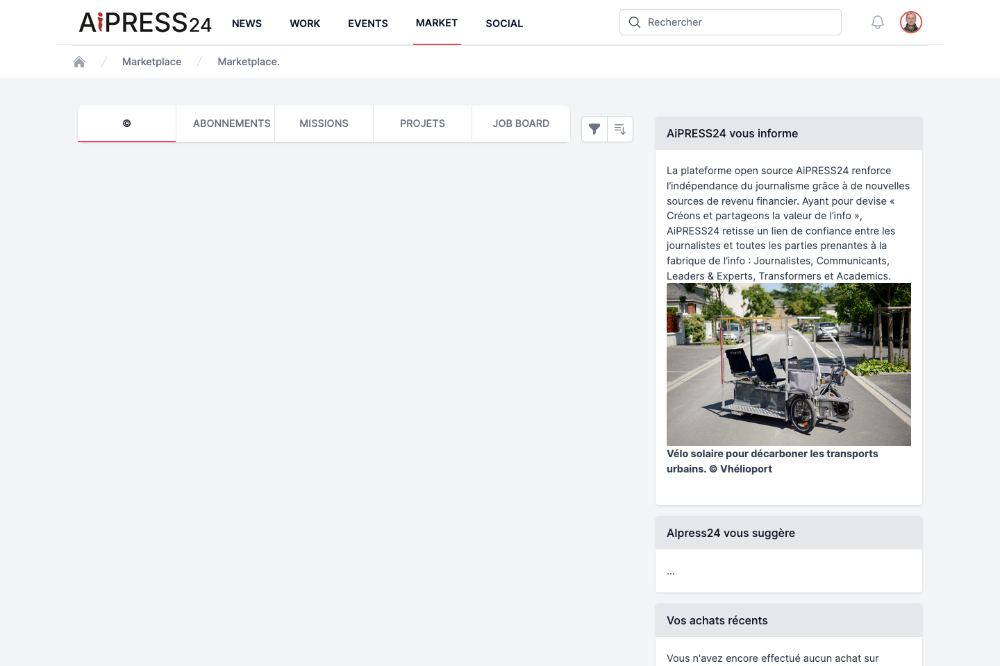
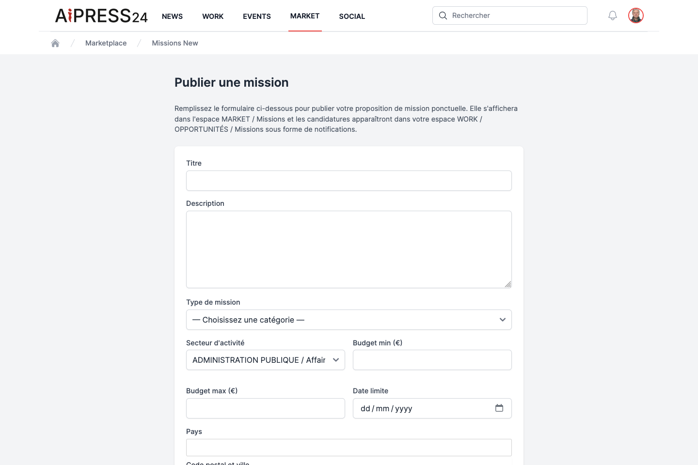

# The Marketplace portal

**Marketplace** is Aipress24's marketplace. Here you publish and respond to **assignments**, **projects** and **job offers**. The portal also has a **Subscriptions** tab (which leads to activating a [Business Wall](business-wall.md)) and a **©** tab dedicated to editorial-rights transfers (see [Monetisation & rights](monetisation.md)).

This page focuses on the three offer boards: Assignments (Missions), Projects (Projets), Job Board. They work the same way: post an offer, browse, apply, then manage applications.

## Assignments (Missions)

An **assignment** is a one-off work proposal (freelance work, copywriting, communication, innovation…).

### Posting an assignment

From the **Missions** tab, click **"+ Publier une mission"** (Post an assignment). The form includes:

- **Title** *(required)* and **Description** *(required, at least 20 characters)* ;
- **Assignment type** *(required)*: Journalism, Communication or Innovation ;
- **Sub-type** (depends on the category) ;
- **Sector of activity** ;
- **Min / max budget**, **Deadline** ;
- **Country** and **postcode & city**.

For a **Journalism** assignment, an extra block ("Fiche descriptive") specifies the profile sought: journalism occupations, press & media types, journalism skills, languages, content types and size, remuneration modes, and two work-mode options (on-site / remote).

!!! note "Journalism assignments"
    Only journalists can post a **Journalism** assignment, and such assignments are only visible to journalists.

Once published, the assignment appears in Marketplace; applications reach you by **notification** and **email**, and are found in **Work › Opportunities › Missions**.

### Applying

On an open assignment's page (if you are not its author), write your application **message** and click **"Candidater"** (Apply). You can only apply once per offer, and not to your own offer. The poster is notified.

### Managing applications received

As the poster, the **"Voir les candidatures reçues"** (View applications received) button opens the list of applicants (profile, message, status). For each pending application, you can add a **message for the applicant**, then **Accept** or **Reject**; the applicant is notified of your decision.

The **"Marquer comme pourvue"** (Mark as filled) button closes the assignment to new applications.

## Projects

A **project** is a larger editorial or collaborative undertaking (team, duration). Posting and management are the same as assignments, with a few specific fields:

- **Project type** and **Sub-type** (Journalism, Communication, Innovation) ;
- **Team size sought**, **Duration (months)** ;
- **Budget**, **Deadline**, location.

A project is applied to and managed like an assignment (application with a message, accept/reject, **Mark as filled**).

## Job Board

The **Job Board** publishes job, internship, work-study, freelance and doctoral-contract offers.

### Posting a job offer

The form includes: **Job title** *(required)*, **Description** *(required)*, **Sector of activity**, **Contract type** (permanent, fixed-term, internship, apprenticeship, freelance, doctoral contract), **Full-time**, **Remote possible**, **Min / max salary (gross/year)**, **Start date**, and the location.

### Applying to a job offer

The application includes a **message** *(required)* and a **link to your CV** (optional). On the poster's side, the CV is accessible via a **"Voir le CV"** (View CV) link.

## Statuses and tracking

All offers follow the same cycle: **Open** (accepts applications) → **Filled** (via "Mark as filled") → **Closed** (an offer whose deadline has passed is automatically closed).

An application moves through the statuses: **Pending → Accepted / Rejected**.

You track all of your applications — sent and received — in **Work › Opportunities**, under the **Missions**, **Projets** and **Emplois** tabs.

## Subscriptions and rights transfers

- The **Subscriptions** tab corresponds to activating a **Business Wall**: see [Business Wall](business-wall.md).
- The **©** tab concerns **rights transfers** of editorial content: see [Monetisation & rights](monetisation.md).
