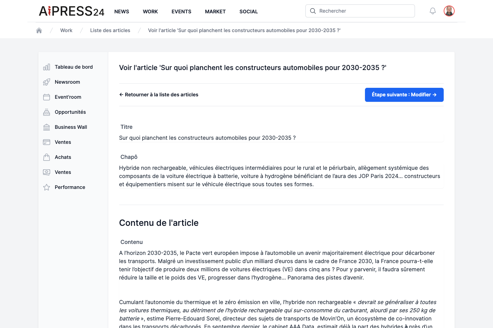
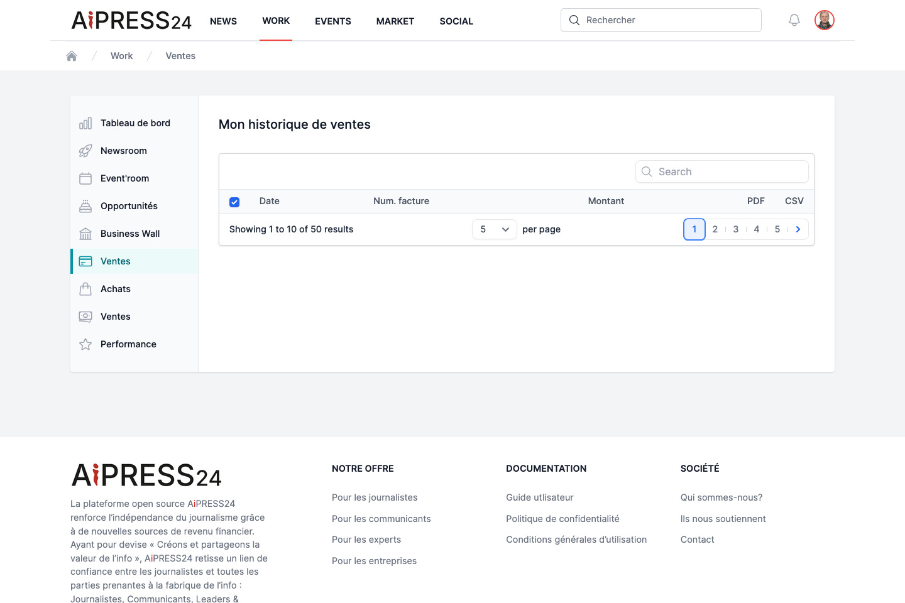

# Monetisation & rights

Aipress24 lets you monetise journalistic content. This page gathers the commercial mechanisms visible to users: the rights offered on an article, rights transfers, and tracking your sales and purchases.

## Rights offered on an article

On a paid article's page, an **"Acquisition"** section offers up to four products. Each purchase opens a confirmation window showing the **net / VAT / gross** amounts, then a secure online card payment.

### Consultation right

Unlocks full reading of the article for **365 days**. Message shown: *"This article was produced by a professional journalist. Paying to read it contributes to the health of the press."*

### Gifted consultation right

Lets you **gift** an article's consultation to one or more contacts. You enter their email addresses (up to 50 recipients); people who already own the article are not charged. Each recipient receives a notification and an email, and gains access to the article.

### Proof of publication

Intended for the people quoted (and their communicators). The proof attests to the publication: the article is durably displayed in the **Press Book** section of your profile and your organisation. An official **PDF** is generated after payment and downloaded from your purchases.

Journalists trigger the invitation to acquire a proof from their article (the **Justificatif** action), aimed at the participants in an investigation — see [Enquiry notices](enquiry-notices.md).

### Reproduction rights (rights transfer)

Lets a press publisher acquire a **reproduction licence** to republish the article. This product is only offered to **eligible buyers**: a publisher with a media-type Business Wall, authorised by the author's transfer policy.

## Rights transfers: the seller side

A media outlet defines **who it agrees to transfer rights to** via the **"Modalités de cession de droits"** (Rights-transfer terms) page (in the Business Wall dashboard, reserved for media). Four options:

- **To all subscribed publishers** (default).
- **Only to publishers I choose** (whitelist).
- **To all publishers except those I exclude** (blacklist).
- **To no one**.

This policy is **frozen onto each piece of content at the moment of its publication**: it therefore does not apply retroactively to already-published articles.

## Tracking your sales and purchases

From the [Work](work.md) portal:

- **Ventes** (Sales) — the record of your editorial sales (consultations, proofs, transfers), in net amounts, with totals. An editor-in-chief also sees the sales made on articles published by their outlet.
- **Achats** (Purchases) — the history of your purchases (consultation, proof, rights transfer), with personal and organisation totals. Gifted articles appear under **Opportunities › Consultations offertes**.
- **Facturation** (Invoicing) — your invoices, downloadable as **PDF** and **CSV**.

You can also find your purchase history directly in the [News](news.md) portal, via "Mes achats" (My purchases).

!!! note "Payments"
    Amounts are shown net of tax; the applicable VAT is calculated at payment time based on your billing address. All payments go through a secure payment provider.
