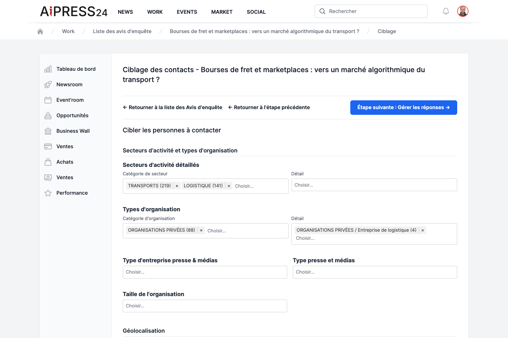

# Les avis d'enquête

L'**avis d'enquête** est un outil de mise en relation entre un **journaliste** qui prépare une enquête et les **experts** susceptibles d'y contribuer. Le journaliste cible des profils, les sollicite, recueille leurs réponses, organise les rendez-vous, puis — après publication — leur adresse un justificatif de publication.

L'avis d'enquête se crée et se pilote depuis **Work › Newsroom › Avis d'enquête**. Chaque avis se déroule selon un parcours en cinq étapes, matérialisé par une barre de navigation : **Voir → Modifier → Cibler les contacts → Gérer les réponses → Gérer les RDV**.

## Côté journaliste

### 1. Créer l'avis

Le formulaire comporte un **Titre**, un **Brief**, les métadonnées habituelles (Genre, Rubrique, Thématique, Secteur), le **Média** et les **dates-clés** (début, fin, bouclage, parution prévue).

### 2. Cibler les contacts

L'étape **Cibler les contacts** vous aide à constituer la liste des experts à solliciter. La plateforme pré-sélectionne un vivier d'experts actifs dont les secteurs recoupent ceux de l'enquête, que vous affinez avec de nombreux filtres, regroupés en quatre familles :

- **Secteurs d'activité et types d'organisation** — secteurs détaillés, types d'organisation, type d'entreprise de presse & médias, taille de l'organisation.
- **Géolocalisation** — pays, département, ville.
- **Fonctions** — fonctions politiques/administratives, organisations privées, associations & syndicats, fonctions du journalisme.
- **Métiers, compétences & langues** — métier, compétences générales, compétences journalisme, langues.

Chaque option indique entre parenthèses le nombre d'experts correspondants. Le tableau des profils trouvés vous permet de **cocher** ceux que vous souhaitez solliciter, puis de **Valider / mettre à jour la sélection**. Une fois votre sélection prête, cliquez sur **Envoyer la demande** et confirmez.

!!! note "Anti-spam"
    Pour préserver les experts, un plafond limite le nombre de sollicitations reçues par personne sur une période glissante. Les experts au plafond sont automatiquement écartés de l'envoi (un message vous l'indique).

À l'envoi, chaque expert sélectionné reçoit une **notification** et un **e-mail** l'invitant à répondre.

### 3. Gérer les réponses

L'étape **Gérer les réponses** liste les réponses reçues (contact, statut, date, état du rendez-vous). Les statuts possibles : **En attente**, **Accepté**, **Refusé**, **Refusé, suggestion**, **Confirmé**.

Pour un expert ayant accepté, vous pouvez **Proposer un RDV**.

### 4. Gérer les rendez-vous

Depuis l'étape **Gérer les RDV**, ou depuis une réponse acceptée, proposez un rendez-vous :

- **Type** : Téléphone, Visioconférence ou Face-à-face.
- **Créneaux** : proposez de 1 à 5 créneaux (en jours ouvrés, aux heures ouvrables).
- **Coordonnées** selon le type (téléphone, lien de visio, ou adresse) et d'éventuelles **notes**.

L'expert accepte l'un des créneaux (ou refuse). Vous pouvez ensuite **Confirmer le RDV**, ou l'**Annuler**. Chaque changement notifie l'autre partie. Les statuts d'un rendez-vous : **Pas de RDV → Proposé → Accepté → Confirmé**.

### 5. Justificatif et rémunération

Après publication de votre article, l'action **Justificatif** (depuis l'article) vous permet de **notifier les participants** à l'enquête : chacun reçoit une notification et une invitation à acquérir le justificatif de publication de l'article. Vous pouvez également adresser une **notification de publication** aux personnes citées.

Chaque justificatif notifié est comptabilisé (colonne **« JdP notifiés »** dans la liste de vos avis) et contribue à la **rémunération** du journaliste au titre de ses enquêtes abouties, alimentée par un fonds mutualisé (une part des revenus des abonnements Business Wall), versée via votre média.

## Côté expert (répondre à un avis)

Lorsqu'un journaliste vous sollicite, l'avis apparaît dans **Work › Opportunités › Avis d'enquête** (« Opportunité média »). La page présente le média, le titre, l'auteur, les dates et le brief.

!!! note "Prérequis"
    Pour répondre à un avis d'enquête, votre organisation doit disposer d'un **Business Wall actif**. À défaut, un bandeau vous invite à le configurer au préalable.

À la question **« Cette enquête vous concerne-t-elle ? »**, quatre réponses sont possibles :

- **Oui** — vous précisez en quoi vous pouvez contribuer.
- **Oui, en associant mon attaché(e) de presse** — vous contribuez et associez le responsable communication/RP de votre organisation.
- **Non** — vous indiquez pourquoi.
- **Non, mais je suggère un collègue** — vous orientez le journaliste vers une personne mieux placée dans votre organisation.

Cliquez sur **Envoyer** et confirmez. Le journaliste est notifié de votre réponse.

Si vous avez accepté, le journaliste vous proposera un ou plusieurs **créneaux de rendez-vous** : sélectionnez celui qui vous convient (ou refusez). Vous recevez ensuite une confirmation.
