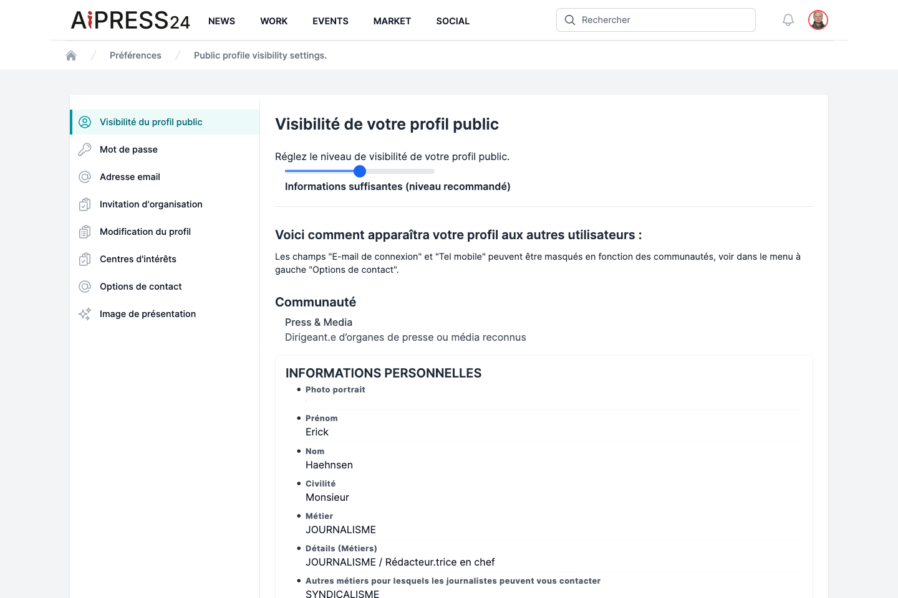

# Votre profil

Votre profil est votre carte d'identité professionnelle sur Aipress24. Sa qualification (fonction, secteurs, compétences…) détermine votre visibilité, votre présence dans l'annuaire et la pertinence des mises en relation (avis d'enquête, missions, projets). Un profil complet et à jour est donc un atout majeur.

## Compléter et modifier votre profil

Vos informations de profil sont recueillies lors de l'[inscription](premiers-pas.md) (le questionnaire KYC) et se modifient ensuite depuis **Préférences › Modification du profil**, qui relance ce même questionnaire.

Le questionnaire est organisé en sections : informations personnelles, description de votre organisation, facteurs de mise en relation (fonctions, centres d'intérêt), hobbies et convivialité, et Business Wall.

!!! note "Modifications soumises à validation"
    La plupart des modifications sont appliquées immédiatement. En revanche, la modification de certains **champs sensibles** (nom, prénom, civilité, métier principal) entraîne une **nouvelle validation** de votre compte par l'équipe : votre profil est temporairement remis en attente le temps de cette vérification.

## Le niveau de visibilité

Depuis **Préférences › Visibilité du profil public**, réglez le niveau de détail visible par les autres membres :

- **Informations minimales** ;
- **Informations suffisantes** (niveau recommandé) ;
- **Informations détaillées**.

Un aperçu vous montre en direct ce que verront les autres membres.

## Les options de contact

Certaines coordonnées sensibles — **e-mail de connexion**, **téléphone mobile** et **e-mail relation presse** — peuvent être masquées de façon sélective.

Depuis **Préférences › Options de contact** (« À qui accordez-vous le droit de voir vos coordonnées ? »), vous choisissez, pour chacun de ces trois champs et pour chaque **communauté** (journalistes, communicants, experts…), qui a le droit de le voir. Un membre dont la communauté n'est pas autorisée verra la valeur masquée.

## Karma et réputation

Votre nom peut être accompagné d'une **médaille de karma** (or, argent, bronze) reflétant votre réputation sur la plateforme. Vous suivez l'évolution de votre **indice de performance réputationnelle** dans **Work › Performance**.

## Image de présentation et centres d'intérêt

- **Préférences › Image de présentation** — chargez le bandeau de couverture de votre profil (ratio 4:1), avec une mention de copyright.
- **Préférences › Centres d'intérêts** — renseignez vos intérêts et hobbies (information pouvant être publique).

## Mot de passe et adresse e-mail

- **Préférences › Mot de passe** — changez votre mot de passe.
- **Préférences › Adresse email** — changez votre e-mail de connexion ; un e-mail de confirmation est envoyé à la nouvelle adresse pour valider le changement.
