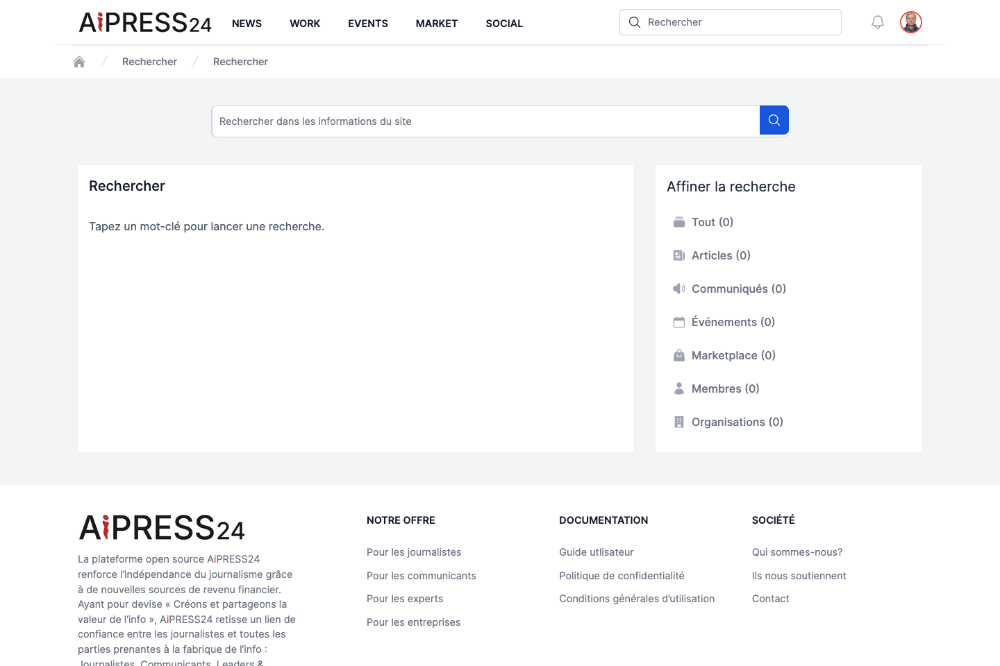

# Rechercher

Le portail **Rechercher** offre une recherche transverse sur l'ensemble de la plateforme, depuis un point d'entrée unique.

## Lancer une recherche

Saisissez un mot-clé dans le champ « Rechercher dans les informations du site » et validez. Les résultats sont regroupés par type, chaque groupe indiquant son nombre de correspondances. Chaque résultat affiche un titre (lien vers l'objet), un extrait et sa date de publication.

## Ce que vous pouvez rechercher

La recherche couvre plusieurs catégories (« buckets »), sélectionnables dans la colonne **Affiner la recherche** :

| Catégorie | Contenu |
|---|---|
| **Tout** | L'ensemble des résultats. |
| **Articles** | Les articles publiés. |
| **Communiqués** | Les communiqués de presse. |
| **Événements** | Les événements publiés. |
| **Marketplace** | Les missions, projets, offres d'emploi et produits éditoriaux. |
| **Membres** | Les membres (profils validés et actifs). |
| **Organisations** | Les organisations actives. |

La colonne latérale indique le nombre de résultats par catégorie ; les catégories sans résultat sont grisées. Le filtre **Tout** est actif par défaut ; cliquez sur une catégorie pour restreindre l'affichage à ce seul type.

Seuls les contenus **publics et validés** apparaissent dans les résultats : articles/communiqués/événements publiés et non expirés, offres publiées, membres actifs et validés, organisations actives.
