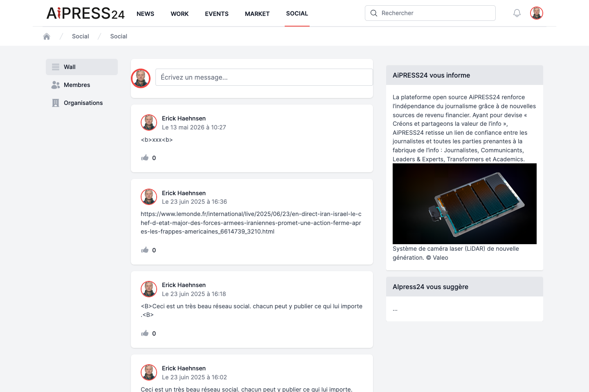
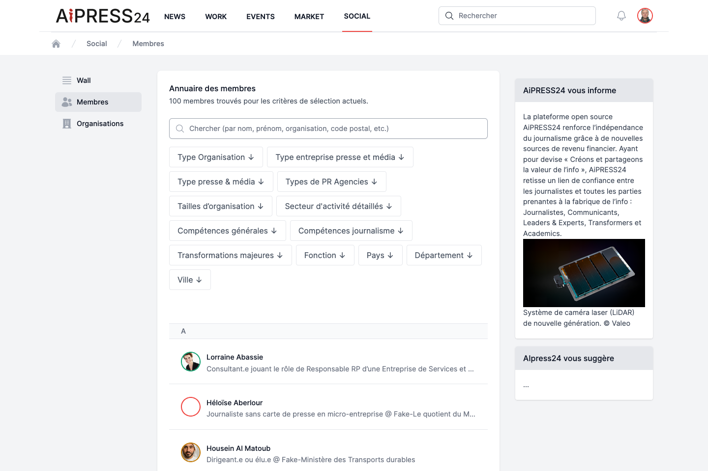
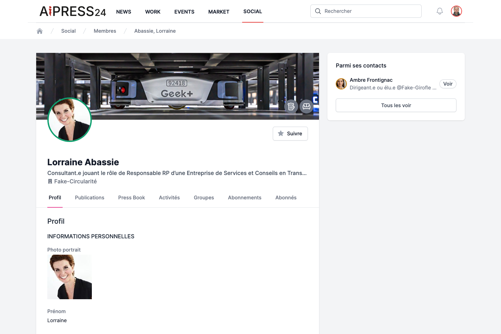

# Le portail Social

**Social** est le réseau professionnel d'Aipress24. Il permet de publier, de suivre des membres et des organisations, de constituer votre carnet de contacts et de rendre votre profil visible. Il s'organise autour de trois espaces : le **Wall**, l'annuaire des **Membres** et l'annuaire des **Organisations**.

## Le Wall (fil d'activité)

Le Wall est votre page d'accueil sociale.

- **Publier un message** : cliquez dans le champ « Écrivez un message… », rédigez votre texte, puis cliquez sur **Poster**. Un message de confirmation s'affiche. (Les messages sont textuels ; il n'y a pas de limite de longueur.)
- **Votre fil** affiche vos propres messages et ceux des membres que vous suivez, du plus récent au plus ancien.
- Chaque message peut être aimé (**J'aime**).

## L'annuaire des membres

L'annuaire liste tous les membres de la plateforme, classés par ordre alphabétique. Un compteur indique le nombre de membres correspondant à vos critères.

- **Recherche plein texte** : « Chercher (par nom, prénom, organisation, code postal, etc.) ».
- **Filtres** (cumulables, affichés en pastilles retirables) :
    - **Type Organisation**, **Type entreprise presse et média**, **Type presse & média**, **Types de PR Agencies**, **Tailles d'organisation** ;
    - **Secteur d'activité détaillés**, **Compétences générales**, **Compétences journalisme**, **Transformations majeures** ;
    - **Fonction** ;
    - **Pays**, **Département**, **Ville**.

Ces filtres exploitent la qualification KYC des profils : plus votre profil est complet, plus vous êtes facile à trouver.

## La fiche d'un membre

La fiche d'un membre (accessible en cliquant sur son nom) présente une image de couverture, sa photo, son nom (avec une médaille de **karma** selon sa réputation), sa fonction et son organisation, ainsi qu'un bouton **Suivre / Ne plus suivre**.

Elle est organisée en onglets :

- **Profil** — les informations qualifiées (présentation, compétences, langues, formations, secteurs, coordonnées…), affichées selon le niveau de visibilité choisi par le membre.
- **Publications** — ses contenus publiés.
- **Press Book** — les articles pour lesquels le membre détient un justificatif de publication.
- **Activités**.
- **Groupes** — ses groupes publics.
- **Abonnements** — les personnes qu'il suit.
- **Abonnés** — les personnes qui le suivent.

!!! note "Confidentialité des coordonnées"
    Trois champs (e-mail de connexion, téléphone mobile, e-mail relation presse) peuvent être masqués. Leur visibilité dépend des **Options de contact** définies par le propriétaire du profil : voir [Votre profil](profil.md).

## Les organisations

L'annuaire des **Organisations** liste les organisations présentes sur la plateforme. On distingue deux natures :

- Une **organisation « Auto »** (non officielle), créée automatiquement à partir des déclarations des membres.
- Une **organisation officielle**, qui dispose d'un **Business Wall** (abonnement) : elle maîtrise sa page, ses contacts presse et ses fonctionnalités métier.

La fiche d'une organisation présente sa couverture, son logo, son nom, un bouton **Suivre**, et des onglets selon son type : **À propos**, **Contacts**, **Publications**, **Press Book**, **Communiqués**, **Événements**.

Si vous êtes membre d'une organisation encore non officielle, un bandeau vous propose de « faire passer la page de votre organisation à la version officielle » — c'est l'activation d'un [Business Wall](business-wall.md).

## Les groupes

- **Annuaire des groupes** : recherchez et parcourez les groupes publics.
- **Créer un groupe** : bouton **+**. Renseignez un **Nom** et une **Description**, puis **Créer le groupe**. Vous en devenez le propriétaire.
- **Rejoindre / Quitter** un groupe depuis sa fiche.

## Suivre des membres et des organisations

Le bouton **Suivre / Ne plus suivre** est présent sur chaque fiche de membre et d'organisation.

Suivre une source alimente votre fil : ses publications remontent sur votre Wall et dans les onglets correspondants du portail [News](news.md) (**Agences**, **Médias**, **Journalistes**). Vos listes se retrouvent dans les onglets **Abonnements** (que vous suivez) et **Abonnés** (qui vous suivent) de votre profil.
